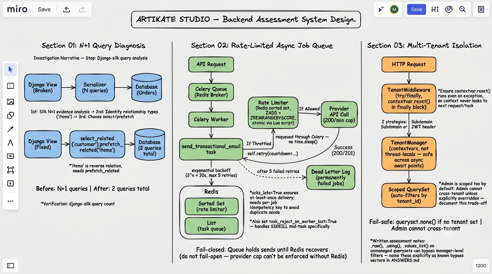

# ARTIKATE STUDIO — Backend Developer Technical Assessment

## Setup

### Prerequisites

- Python 3.11+
- Redis (for Section 02 rate limiter and Celery broker)

### Installation

```bash
# Clone the repository
git clone <repository-url>
cd artikate-assessment

# Create virtual environment
python -m venv venv
source venv/bin/activate  # Linux/Mac
# venv\Scripts\activate   # Windows

# Install dependencies
pip install -r requirements.txt

# Run migrations
python manage.py migrate

# Start Redis (required for Section 02)
# Windows: redis-server
# Linux: sudo systemctl start redis
# Docker: docker run -d -p 6379:6379 redis:7

# Run the development server
python manage.py runserver

# Run all tests
python manage.py test section01 section02 section03 --verbosity=2
```

### Quick Verification

```bash
# Section 01: Compare query counts
curl http://localhost:8000/api/orders/profiler-compare/

# Section 02: Check rate limiter status (requires Redis)
curl http://localhost:8000/api/queue/rate-status/

# Section 03: List tenant orders (requires X-Tenant-ID header)
curl -H "X-Tenant-ID: 1" http://localhost:8000/api/tenants/orders/
```

## Project Structure

```
artikate-assessment/
├── README.md           # This file
├── DESIGN.md           # Section 02 architecture decisions
├── ANSWERS.md          # Written answers for all sections
├── requirements.txt    # Python dependencies
├── manage.py
├── config/
│   ├── settings.py     # Django + Celery configuration
│   ├── urls.py
│   ├── celery.py
│   └── wsgi.py
├── section01/          # Diagnose a Broken System
│   ├── models.py       # Customer, Product, Order, OrderItem
│   ├── views.py        # Broken (N+1) and Fixed (select_related) views
│   ├── serializers.py
│   ├── tests.py        # N+1 query count proof
│   └── urls.py
├── section02/          # Rate-Limited Async Job Queue
│   ├── tasks.py        # Celery tasks with retry + dead-letter
│   ├── rate_limiter.py # Sliding window rate limiter (Redis Lua script)
│   ├── views.py        # API endpoints for sending + rate status
│   ├── tests.py        # Rate limiter + 500-job tests
│   └── urls.py
└── section03/          # Multi-Tenant Data Isolation
    ├── models.py       # Tenant-scoped Order + Product models
    ├── managers.py     # TenantManager (auto-scoping)
    ├── middleware.py    # TenantMiddleware (header/subdomain extraction)
    ├── context.py      # contextvars-based tenant context
    ├── tests.py        # Cross-tenant isolation proof
    └── urls.py
```

## System Design



## Sections

### Section 01 — Diagnose a Broken System

- **Broken endpoint:** `GET /api/orders/summary/` — demonstrates N+1 query problem
- **Fixed endpoint:** `GET /api/orders/summary/fixed/` — uses `select_related` + `prefetch_related`
- **Profiler comparison:** `GET /api/orders/profiler-compare/` — returns query counts for both approaches
- **Profiler evidence:** Silk middleware is integrated. Access the Silk dashboard at `/silk/` to see individual request profiling.

### Section 02 — Rate-Limited Async Job Queue

- **Send single email:** `POST /api/queue/send/` with `{"to": "...", "subject": "...", "body": "..."}`
- **Send batch:** `POST /api/queue/send-batch/` with `{"recipients": [...]}`
- **Rate status:** `GET /api/queue/rate-status/`
- **Requires Redis** running on `localhost:6379`

### Section 03 — Multi-Tenant Data Isolation

- **Tenant orders:** `GET /api/tenants/orders/` with `X-Tenant-ID` header
- **Tenant products:** `GET /api/tenants/products/` with `X-Tenant-ID` header
- Automatic tenant scoping via `TenantManager` — no manual filtering needed

### Section 04 — Written Architecture Review

See `ANSWERS.md` for answers to Questions A (Django Admin Performance) and C (File Upload Security).

## Running Tests

```bash
# Run all tests
python manage.py test section01 section02 section03 --verbosity=2

# Run specific section
python manage.py test section01 --verbosity=2
python manage.py test section02 --verbosity=2
python manage.py test section03 --verbosity=2
```

Note: Section 02 tests that interact with Redis require Redis to be running on `localhost:6379`.

## Profiler Evidence

Silk is integrated and configured. To capture before/after profiler evidence:

1. Start the server: `python manage.py runserver`
2. Access Silk dashboard: `http://localhost:8000/silk/`
3. Hit the broken endpoint: `GET /api/orders/summary/`
4. Hit the fixed endpoint: `GET /api/orders/summary/fixed/`
5. Compare query counts in the Silk timeline

The `/api/orders/profiler-compare/` endpoint programmatically returns both query counts for automated comparison.

## Optional: Loom Recording (Section 5)

> 🎥 **Loom link:** _(add your Loom URL here after recording)_

The recording covers:
- Fresh terminal startup (Redis + Celery worker)
- Submitting 100+ jobs and watching the Redis queue fill live
- Rate limiter throttling at exactly 200/min (ZSET visible in redis-cli)
- At least one failure retrying with exponential backoff
- Dead-letter path demonstrated

See `LOOM_SCRIPT.md` in this repo for the full narration script and terminal commands.
